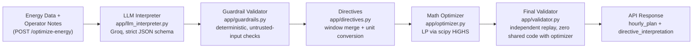

# GridWise

## 1. Architecture

GridWise uses a hybrid neuro-symbolic architecture to ensure 100% hard-constraint adherence. **The LLM performs the semantic interpretation of operator notes into the structured directives used to build the optimization constraints. Deterministic code does everything else: validation, guardrails, arithmetic, LP optimization, and replay.**

This follows the canonical end-to-end flow required by the Problem Statement (Section 03):
`Energy Data + Operator Notes → LLM Interpreter → Guardrail Validator → Math Optimizer → Final Validator → API Response`



**Core idea (Problem Statement Section 03):** human notes are never trusted as math directly. They are first converted to a fixed structured format by the LLM, checked by deterministic guardrails, and only then applied to the optimization model. `app/validator.py` re-derives every physical constraint from scratch (effective solar, active reserve, grid cap, charge/discharge bounds) independently of the optimizer, so a bug in one cannot hide behind the other.

### Request Flow
1. **Validation**: Strict Pydantic parsing of the incoming scenario.
2. **Cache Check**: Exact JSON hash match against previous runs.
3. **LLM Interpreter**: Single Groq call to classify and extract numerical parameters from all operator notes.
4. **Guardrails**: Deterministic checks on the LLM output.
5. **Directives**: Code combines overlapping windows and computes exact unit bounds per hour.
6. **Optimizer**: Linear Programming (`scipy.optimize.linprog` with HiGHS) solves for the exact minimum cost.
7. **Canonicalization**: Snaps dust, rebuilds SOC exactly, rounds values to 8 decimal places.
8. **Replay Validator**: Independent check ensures the final plan perfectly matches all physical constraints.
9. **Assembly**: Final response built securely, including deterministic plan summary.

## 2. Model/Provider

- **Provider**: Groq
- **Primary Model**: `openai/gpt-oss-20b`
- **Fallback Model**: `openai/gpt-oss-120b`
- **Decoding**: Strict JSON-schema structured outputs
- **Temperature**: 0 (with fixed seed for maximum determinism)

## 3. Guardrails

Our deterministic IR validation (`guardrails.py`) includes:
- `json.loads` handler that raises on NaN/Infinity (defense in depth).
- Top shape check: verifies note count and ensures unique `note_index` values without gaps.
- `directive_type` enum validation.
- Per-type field contracts (ensuring irrelevant fields are strictly null).
- Window sanity checks (start_hour 0-23, end_hour 1-24, expanded union ≤ 24 hours).
- Finite math checks (`math.isfinite`) for all numbers.
- Strict rejection without guessing or repairing values.
- Per-note violation collection, enabling selective degradation of broken notes rather than failing the whole request.

## 4. Optimizer

Linear Programming over grid, solar, and signed-battery-flow variables.
- Powered by `scipy.optimize.linprog(method="highs")`.
- Finds the exact mathematical optimum (minimum cost).
- Protected by independent replay validation before every single response.

## 5. Environment Variables

| Variable | Default | Purpose |
|---|---|---|
| `GROQ_API_KEYS` | *(unset)* | Comma-separated list of Groq keys, rotated per-request. |
| `GROQ_API_KEY` | *(unset)* | Single-key fallback, read only if `GROQ_API_KEYS` is unset/empty. |
| `PORT` | `8000` | Port uvicorn binds to. |
| `PRIMARY_MODEL` | `openai/gpt-oss-20b` | First rung of the interpretation ladder. |
| `FALLBACK_MODEL` | `openai/gpt-oss-120b` | Second model tried on failure. |
| `LLM_TIMEOUT_PRIMARY` | `6.0` | Per-attempt timeout (seconds) for `PRIMARY_MODEL`. |
| `LLM_TIMEOUT_FALLBACK` | `8.0` | Per-attempt timeout (seconds) for `FALLBACK_MODEL`. |
| `LLM_DEADLINE_SECONDS` | `20.0` | Global wall-clock budget for the whole ladder (I35). |
| `PROMPT_COMPACT` | `0` | `1` trims the few-shot bank (TPM escape hatch only). |
| `ALT_BASE_URL` | *(unset)* | Optional cross-provider rung; the ladder is Groq-only if unset. |
| `ALT_API_KEY` | *(unset)* | Key for the optional ALT provider. |
| `ALT_MODEL` | *(unset)* | Model name for the optional ALT provider. |

Missing `GROQ_API_KEYS`/`GROQ_API_KEY` is not an error at boot — `/health` still
returns `{"status":"ok"}` and `/optimize-energy` degrades every note to
`no_op` and still returns **200** (see Known Limitations).

## 6. Local Quickstart

```bash
git clone https://github.com/sakibul-shovon/bup-hackathon-preli.git
cd bup-hackathon-preli
python -m venv .venv
source .venv/bin/activate      # Windows: .venv\Scripts\activate
pip install -r requirements.txt
export GROQ_API_KEYS="your_api_key_here"    # Windows (PowerShell): $env:GROQ_API_KEYS="your_api_key_here"
uvicorn app.main:app --host 0.0.0.0 --port 8000
```

The service boots and answers `/health` even with `GROQ_API_KEYS` unset --
only `/optimize-energy` needs a real key to produce non-degraded
interpretations (see Environment Variables below).

## 7. Verify

Check health:
```bash
curl http://localhost:8000/health
```
Expected output:
```json
{"status":"ok"}
```

Sample optimization request (a real, complete, POST-able body -- `hours` must
have exactly 24 entries, one per hour 0-23):
```bash
curl -X POST http://localhost:8000/optimize-energy \
-H "Content-Type: application/json" \
-d '{
  "scenario_id": "test-01",
  "operator_notes": ["Reduce solar output by 20% between 12 PM and 2 PM."],
  "battery": {
    "capacity_kwh": 500.0,
    "initial_energy_kwh": 200.0,
    "minimum_energy_kwh": 100.0,
    "max_charge_kwh_per_hour": 100.0,
    "max_discharge_kwh_per_hour": 100.0
  },
  "hours": [
    {"hour": 0, "demand_kwh": 80, "solar_kwh": 0, "tariff_bdt_per_kwh": 5},
    {"hour": 1, "demand_kwh": 85, "solar_kwh": 0, "tariff_bdt_per_kwh": 5},
    {"hour": 2, "demand_kwh": 90, "solar_kwh": 0, "tariff_bdt_per_kwh": 5},
    {"hour": 3, "demand_kwh": 95, "solar_kwh": 0, "tariff_bdt_per_kwh": 5},
    {"hour": 4, "demand_kwh": 100, "solar_kwh": 0, "tariff_bdt_per_kwh": 5},
    {"hour": 5, "demand_kwh": 105, "solar_kwh": 0, "tariff_bdt_per_kwh": 5},
    {"hour": 6, "demand_kwh": 80, "solar_kwh": 0, "tariff_bdt_per_kwh": 5},
    {"hour": 7, "demand_kwh": 85, "solar_kwh": 0, "tariff_bdt_per_kwh": 5},
    {"hour": 8, "demand_kwh": 90, "solar_kwh": 60, "tariff_bdt_per_kwh": 5},
    {"hour": 9, "demand_kwh": 95, "solar_kwh": 60, "tariff_bdt_per_kwh": 5},
    {"hour": 10, "demand_kwh": 100, "solar_kwh": 60, "tariff_bdt_per_kwh": 5},
    {"hour": 11, "demand_kwh": 105, "solar_kwh": 60, "tariff_bdt_per_kwh": 5},
    {"hour": 12, "demand_kwh": 80, "solar_kwh": 60, "tariff_bdt_per_kwh": 5},
    {"hour": 13, "demand_kwh": 85, "solar_kwh": 60, "tariff_bdt_per_kwh": 5},
    {"hour": 14, "demand_kwh": 90, "solar_kwh": 60, "tariff_bdt_per_kwh": 5},
    {"hour": 15, "demand_kwh": 95, "solar_kwh": 60, "tariff_bdt_per_kwh": 5},
    {"hour": 16, "demand_kwh": 100, "solar_kwh": 60, "tariff_bdt_per_kwh": 5},
    {"hour": 17, "demand_kwh": 105, "solar_kwh": 60, "tariff_bdt_per_kwh": 9},
    {"hour": 18, "demand_kwh": 80, "solar_kwh": 0, "tariff_bdt_per_kwh": 9},
    {"hour": 19, "demand_kwh": 85, "solar_kwh": 0, "tariff_bdt_per_kwh": 9},
    {"hour": 20, "demand_kwh": 90, "solar_kwh": 0, "tariff_bdt_per_kwh": 9},
    {"hour": 21, "demand_kwh": 95, "solar_kwh": 0, "tariff_bdt_per_kwh": 9},
    {"hour": 22, "demand_kwh": 100, "solar_kwh": 0, "tariff_bdt_per_kwh": 9},
    {"hour": 23, "demand_kwh": 105, "solar_kwh": 0, "tariff_bdt_per_kwh": 9}
  ]
}'
```

Expected response shape (real fields, `hourly_plan` trimmed to 2 of its 24
entries here for brevity -- the actual response always has all 24):
```json
{
  "scenario_id": "test-01",
  "directive_interpretation": [
    {
      "note_index": 0,
      "applies": true,
      "directive_type": "solar_reduction",
      "structured_adjustment": {"hours": [12, 13], "factor": 0.8},
      "explanation": "Solar reduced by 20 percent during panel work."
    }
  ],
  "hourly_plan": [
    {
      "hour": 0,
      "grid_kwh": 0.0,
      "solar_used_kwh": 0.0,
      "battery_action": "discharge",
      "battery_kwh": 80.0,
      "battery_energy_after_kwh": 120.0
    },
    {
      "hour": 1,
      "grid_kwh": 65.0,
      "solar_used_kwh": 0.0,
      "battery_action": "discharge",
      "battery_kwh": 20.0,
      "battery_energy_after_kwh": 100.0
    }
  ],
  "total_grid_kwh": 1644.0,
  "total_cost_bdt": 9420.0,
  "peak_grid_kwh": 205.0,
  "plan_summary": "Purchased 1644.0 kWh from the grid for 9420.0 BDT, peaking at 205.0 kWh in hour 5. Charged the battery in hours 3-5, 7, 9, 11, 16, 18 and discharged in hours 0-1, 6, 8, 10, 12-15, 17, 20-23. Applied operator directives: solar_reduction."
}
```

Each `hourly_plan` entry has exactly these six fields: `hour`, `grid_kwh`,
`solar_used_kwh`, `battery_action`, `battery_kwh`, `battery_energy_after_kwh`
-- nothing else (I18). `directive_interpretation` has one entry per operator
note, in note order, with `applies=false` and `structured_adjustment=null`
for `no_op` (I11).

Without a real `GROQ_API_KEYS`/`GROQ_API_KEY`, the note above degrades to
`no_op` (I5) and the numbers above will differ -- this exact response was
captured with a mocked Groq call returning the shown interpretation.

## 8. Public Sample Validation

```bash
python scripts/run_public_cases.py http://localhost:8000
```
*(Expected output: 10/10 valid, 10/10 optimal within tolerance)*

## 9. Tests

Run the test suite:
```bash
pytest -q
```
*(Note: tests requiring the LLM require the `GROQ_API_KEYS` environment variable and must be run with `-m live`)*

## 10. Docker Fallback

```bash
docker pull ghcr.io/sakibul-shovon/bup-hackathon-preli:final
docker run -p 8000:8000 -e GROQ_API_KEYS="your_key_here" ghcr.io/sakibul-shovon/bup-hackathon-preli:final
```

Also tagged `:latest`. Image is `linux/amd64`, binds `0.0.0.0:8000`, and
contains no baked-in secrets -- `GROQ_API_KEYS` is supplied at `docker run`
time only. The package is kept **private until the submission deadline**,
matching this repository's own visibility policy; it is made public at the
same time the repository is.

## 11. Dependencies & Credits

| Package | Purpose |
|---|---|
| `fastapi` | API Framework |
| `uvicorn[standard]` | ASGI Server |
| `httpx` | Async HTTP Client |
| `scipy` | Optimizer (HiGHS) |
| `numpy` | Numeric structures |
| `pytest` | Testing |

Special credits as required by competition rules:
- **scipy / HiGHS**: Linear programming solver
- **FastAPI**: Backend web framework
- **Groq**: LLM infrastructure and inference
- **AI Assistants**: Built with assistance from standard AI coding tools.

## 12. Known Limitations

- System depends on Groq API availability and quota.
- **If the model provider is unavailable, the service degrades to a valid schedule with notes reported as `no_op` and still returns HTTP 200 — it never returns a 5xx.**
- Alternate optimal schedules are possible under flat tariffs (battery cycling cost-neutral).
- Overlapping-solar-directive product semantics (handled deterministically).
- Vague time expressions are mapped tightly by convention, rather than being left unanswered.

## 13. Secret Handling

- Keys are injected via environment variables only.
- Keys are never committed, logged in plaintext, or returned in API responses.
